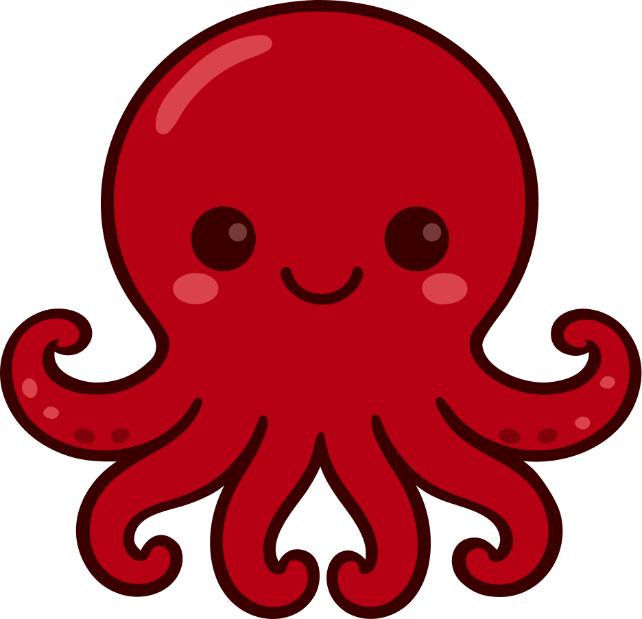

# Octopal

<p align="center">
  
</p>

<h1 align="center">Multi-Model AI Agent Orchestration</h1>

<p align="center">
  Run Claude, GPT, and Ollama agents together in one workspace.<br />
  Assign the right model to each role. Let them collaborate.<br />
  Free & open source — macOS & Windows.
</p>

<p align="center">
  
  
  
  
  
  
  
  
  
</p>

<p align="center">
  <a href="https://www.producthunt.com/posts/octopal-open-source?embed=true&utm_source=badge-featured&utm_medium=badge&utm_souce=badge-octopal-open-source" target="_blank"></a>
</p>

<p align="center">
  🌐 <a href="https://octopal.app"><strong>octopal.app</strong></a> &nbsp;|&nbsp;
  <strong>English</strong> | <a href="README.ko.md">한국어</a>
</p>

<p align="center">
  
</p>

---

## What is Octopal?

Octopal is a **multi-model AI agent orchestrator** with a group chat interface. Run Claude, GPT, and Ollama agents side by side, each assigned to its own role, and let them collaborate in real time.

Built on [**Goose**](https://github.com/block/goose) (by Block), an open-source framework that routes each agent to the right provider through the Agent Control Protocol (ACP). No single-vendor lock-in: pick the best model for each job and swap freely.

All agent data lives in your project's `octopal-agents/` folder. Each agent is a subfolder with `config.json` and `prompt.md`. No cloud, no accounts.

## Why Multi-Model?

Different models are good at different things. Octopal lets you assign the right model to each role instead of forcing every agent through one provider.

| Role | Model | Why |
|------|-------|-----|
| Code review | Claude Opus | Deep reasoning, long context |
| Frontend dev | GPT-4o | Fast iteration, broad knowledge |
| Local drafts | Ollama (Llama) | Offline, free, private |
| Strategy | GPT-5 | Structured analysis |

Mix providers in the same room. Agents talk to each other regardless of which model powers them.

## Highlights

| | Feature | Description |
|---|---------|-------------|
| 🤖 | **Multi-Model Orchestration** | Run Claude, GPT, and Ollama agents in the same room. Cross-model collaboration out of the box. |
| 🎯 | **Per-Agent Model Assignment** | Assign a specific model to each agent. Mix and match providers freely per role. |
| 🏠 | **Local Models (Ollama)** | Connect Ollama or any OpenAI-compatible local server. Fully offline, no API keys needed. |
| 🧠 | **Smart Routing** | A hidden orchestrator reads context and calls the right agent at the right time. |
| 💬 | **Group Chat** | Agents talk to each other and to you in a natural chat. @mention to direct, or let the orchestrator decide. |
| 🔗 | **Agent-to-Agent** | Agents @mention each other, triggering chain collaboration without your intervention. |
| 🐙 | **Octo Agents** | Define agents in `octopal-agents/` subfolders. Each folder is an independent agent with its own config and prompt. |
| 📁 | **Folder = Team** | Each folder is a team, each workspace is a company. Organize agents the way you organize files. |
| 🔒 | **Local-first** | Everything runs on your machine. No cloud servers, no data collection. |

## How It Works

1. **Open Octopal App** — Launch the app and open a workspace. That's your company — ready in seconds.
2. **Add a Folder** — Add a folder with an `octopal-agents/` directory. Each folder is a team, each subfolder is an agent — alive and ready to work.
3. **Create Agents & Chat** — Give each agent a role and start chatting. @mention who you need, or let the orchestrator route the conversation.

## Features

### Chat
- Multi-agent group chat — A hidden mediator agent automatically summons domain-expert agents that can answer your questions.
- `@mention` routing, `@all` broadcast
- Real-time streaming responses + Markdown rendering (GFM, syntax highlighting)
- Image/text file attachments (drag & drop, paste)
- Consecutive message debouncing (1.2s buffer before agent invocation)
- Message pagination (loads 50 messages on scroll-up)

### Agent Management
- Create/edit/delete agents (name, role, emoji icon, color)
- Granular permission control (file write, shell execution, network access)
- Path-based access control (allowPaths / denyPaths)
- Agent handoff & permission request UI
- Automatic dispatcher routing

### Wiki
- Shared knowledge base per workspace — notes, decisions, and context accessible to all agents and sessions
- Markdown page CRUD (create, read, update, delete)
- Real-time editing with live preview
- All agents in the same workspace can read and write wiki pages
- Persistent across sessions — wiki pages survive app restarts

### Workspace
- Create/rename/delete workspaces
- Multi-folder management (add/remove folders)
- `octopal-agents/` change detection (file system watch)

## Prerequisites

To build Octopal from source you need two things on your machine:

### 1. Rust toolchain (for the Tauri backend)

Octopal is a Tauri app, so `cargo` must be available on your `PATH`.

```bash
# macOS / Linux
curl --proto '=https' --tlsv1.2 -sSf https://sh.rustup.rs | sh
source "$HOME/.cargo/env"
```

> On Windows, download and run [`rustup-init.exe`](https://rustup.rs) instead.
> You may also need platform-specific dependencies listed in the
> [Tauri prerequisites guide](https://tauri.app/start/prerequisites/)
> (Xcode Command Line Tools on macOS, WebView2 + MSVC on Windows,
> `webkit2gtk` on Linux).

### 2. Provider CLIs (for the AI agents)

Octopal routes each agent to a provider through Goose's ACP. Install the
CLIs for the providers you actually plan to use — at least one is
required:

```bash
# Anthropic (Claude) — Pro/Max subscription via claude-acp adapter
npm install -g @anthropic-ai/claude-code           # the `claude` CLI
npm install -g @zed-industries/claude-agent-acp    # ACP adapter
claude login                                       # OAuth once

# OpenAI (GPT) — ChatGPT Plus/Pro subscription via chatgpt_codex
npm install -g @openai/codex                       # the `codex` CLI
codex login                                        # OAuth once
# Octopal handles ChatGPT-side OAuth on first message via Goose
```

> Why two npm packages for Claude? Goose v1.31.0's `claude-acp` provider
> spawns the `claude-agent-acp` adapter, which itself shells out to the
> `claude` CLI. Both must be on `PATH`. Octopal's PATH augmentation
> covers nvm/asdf/homebrew installs automatically.

> Octopal's API-key path (Settings → Providers → API Key) doesn't
> require these CLIs — only the CLI-subscription path does. If you
> don't have a Claude Pro/Max or ChatGPT subscription, paste an API
> key instead.

## Download

👉 **[Download the latest release](https://github.com/gilhyun/Octopal/releases)** (macOS / Windows)

> **⚠️ Note for Windows users**
>
> You may see a security warning when launching the app for the first time.
>
> - **Windows**: _Windows protected your PC_ (SmartScreen) → Click **"More info"** → **"Run anyway"**.

### Linux without a keyring daemon

Octopal stores API keys in the OS keyring (macOS Keychain, Windows Credential Manager, Linux Secret Service). Most Linux desktops ship a Secret Service daemon (`gnome-keyring` / `kwallet`), but minimal WMs, headless setups, and docker containers often don't. See [docs/troubleshooting-linux-keyring.md](docs/troubleshooting-linux-keyring.md) for the install-a-daemon path and the documented env-var fallback (`OCTOPAL_API_KEY_FALLBACK=env`).

## Getting Started

We use **pnpm** (declared via `packageManager` in `package.json`). If you
don't have it: `corepack enable && corepack prepare pnpm@latest --activate`.

```bash
# Install dependencies
pnpm install

# Development mode (Hot Reload)
pnpm dev

# Production build
pnpm build
```

### Scripts

| Command | Description |
|---------|-------------|
| `pnpm dev` | Run Tauri dev mode (Vite + Rust backend with hot reload) |
| `pnpm build` | Production build — compiles Rust backend + Vite frontend, produces `.app` and `.dmg` (or platform equivalent). **No signing key required.** |
| `pnpm build:signed` | Release build with updater artifacts. **Maintainers only** — requires `TAURI_SIGNING_PRIVATE_KEY` env var (used by CI for the GitHub releases auto-update channel). |

> **Why `pnpm build` instead of `pnpm tauri build`?** The former goes
> through `scripts/tauri-build.mjs`, which conditionally enables updater
> artifacts only when a signing key is present. The latter calls the Tauri
> CLI directly, which is also fine for plain `.app`/`.dmg` builds — the
> default `tauri.conf.json` ships with `createUpdaterArtifacts: false` so
> contributors never hit the "private key not set" error.

## Building & CI

### GitHub Actions (Automated Release)

Octopal uses GitHub Actions to automatically build and release when a version tag is pushed:

```bash
# Tag a release and push — CI builds macOS + Windows automatically
git tag v0.1.43
git push origin v0.1.43
```

The workflow (`.github/workflows/release.yml`) does:
1. **Build** — macOS (universal: Intel + Apple Silicon) and Windows (MSI + NSIS) in parallel
2. **Bundle Goose** — Downloads the Goose sidecar binary for each platform
3. **Sign & Notarize** — Code signing + Apple notarization (maintainer secrets required)
4. **Release** — Creates a GitHub Release with DMG, MSI, EXE, and auto-update artifacts

### Forking & Building Yourself

If you fork Octopal, CI will run on your fork too. Here's what to know:

| Item | What happens |
|------|-------------|
| **Secrets** | Your fork does NOT have the original repo's secrets. Signing/notarization will be skipped — you'll get unsigned builds. |
| **GITHUB_TOKEN** | Automatically provided by GitHub for your fork. Releases will be created on YOUR fork's releases page. |
| **Goose sidecar** | Downloaded from Block's public GitHub releases — works without any secrets. |
| **Auto-update** | Won't work without `TAURI_SIGNING_PRIVATE_KEY`. Users will need to manually download new versions. |

To set up signing on your fork, add these repository secrets:
- `TAURI_SIGNING_PRIVATE_KEY` — For updater artifact signing
- `APPLE_CERTIFICATE` / `APPLE_CERTIFICATE_PASSWORD` — For macOS code signing
- `APPLE_ID` / `APPLE_PASSWORD` / `APPLE_TEAM_ID` — For Apple notarization

> No secrets? No problem. `pnpm build` produces a working unsigned app locally.

## Tech Stack

| Layer | Tech |
|-------|------|
| Desktop | Tauri 2 (Rust backend) |
| Frontend | React 18 + TypeScript 5.6 |
| Build | Vite 5 + Cargo |
| AI Engine | Goose ACP (Claude + OpenAI multi-provider) |
| Markdown | react-markdown + remark-gfm + rehype-highlight |
| Icons | Lucide React |
| i18n | i18next + react-i18next |
| Styling | CSS (Dark Theme + Custom Fonts) |

> **Why Rust?** Octopal uses [Tauri 2](https://tauri.app) instead of Electron. The Rust-based backend provides significantly smaller binary sizes (~10MB vs ~200MB), lower memory usage, and native OS integration — while keeping the same React + TypeScript frontend.

## Project Structure

```
Octopal/
├── src-tauri/                    # Tauri / Rust backend
│   ├── src/
│   │   ├── main.rs               # App entry point
│   │   ├── lib.rs                # Plugin registration, command routing
│   │   ├── state.rs              # Shared app state
│   │   └── commands/             # Tauri IPC command handlers
│   │       ├── agent.rs          # Agent lifecycle
│   │       ├── claude_cli.rs     # Claude CLI spawn & streaming
│   │       ├── dispatcher.rs     # Message routing / orchestration
│   │       ├── files.rs          # File system operations
│   │       ├── folder.rs         # Folder management
│   │       ├── workspace.rs      # Workspace CRUD
│   │       ├── wiki.rs           # Wiki page CRUD
│   │       ├── settings.rs       # App settings
│   │       ├── octo.rs           # Agent config read/write (octopal-agents/)
│   │       ├── backup.rs         # State backup
│   │       └── file_lock.rs      # File locking
│   ├── Cargo.toml                # Rust dependencies
│   └── tauri.conf.json           # Tauri app configuration
│
├── renderer/src/                 # React frontend
│   ├── App.tsx                   # Root component (state management, agent orchestration)
│   ├── main.tsx                  # React entry point
│   ├── globals.css               # Global styles (dark theme, fonts, animations)
│   ├── types.ts                  # Runtime type definitions
│   ├── utils.ts                  # Utilities (color, path)
│   ├── global.d.ts               # TypeScript global interfaces
│   │
│   ├── components/               # UI components
│   │   ├── ChatPanel.tsx         # Chat UI (messages, composer, mentions, attachments)
│   │   ├── LeftSidebar.tsx       # Workspace/folder/tab navigation
│   │   ├── RightSidebar.tsx      # Agent list & activity status
│   │   ├── ActivityPanel.tsx     # Agent activity log
│   │   ├── WikiPanel.tsx         # Wiki page management
│   │   ├── SettingsPanel.tsx     # Settings (general/agent/appearance/shortcuts/about)
│   │   ├── AgentAvatar.tsx       # Agent avatar
│   │   ├── MarkdownRenderer.tsx  # Markdown renderer
│   │   ├── EmojiPicker.tsx       # Emoji picker
│   │   ├── MentionPopup.tsx      # @mention autocomplete
│   │   └── modals/               # Modal dialogs
│   │
│   └── i18n/                     # Internationalization
│       ├── index.ts              # i18next configuration
│       └── locales/
│           ├── en.json           # English
│           └── ko.json           # Korean
│
└── assets/                       # Logo, icons
```

## Architecture

```
┌──────────────────────────────────────────────┐
│                  Tauri 2                      │
│  ┌─────────────┐         ┌────────────────┐  │
│  │  Rust Core   │  IPC    │   WebView      │  │
│  │  (commands/) │◄───────►│   (React)      │  │
│  │  lib.rs      │ invoke  │   App.tsx      │  │
│  └──────┬──────┘         └───────┬────────┘  │
│         │                        │            │
│    ┌────▼────┐           ┌──────▼──────┐     │
│    │ File    │           │ Components  │     │
│    │ System  │           │ ChatPanel   │     │
│    │ Agents  │           │ Sidebars    │     │
│    │ Wiki    │           │ Modals      │     │
│    │ State   │           │ Settings    │     │
│    └────┬────┘           └─────────────┘     │
│         │                                     │
│    ┌────▼────┐                               │
│    │ Goose   │                               │
│    │ ACP     │                               │
│    │ (spawn) │                               │
│    └────┬────┘                               │
│         │                                     │
│    ┌────▼────────────────────┐               │
│    │ Claude CLI │ OpenAI Codex│               │
│    │ (Anthropic)│ (OpenAI)   │               │
│    └─────────────────────────┘               │
└──────────────────────────────────────────────┘
```

## Data Storage

| Item | Path |
|------|------|
| State (Dev) | `~/.octopal-dev/state.json` |
| State (Prod) | `~/.octopal/state.json` |
| Chat history | `~/.octopal/room-log.json` |
| Attachments | `~/.octopal/uploads/` |
| Wiki | `~/.octopal/wiki/{workspaceId}/` |
| Settings | `~/.octopal/settings.json` |

## Changelog

See [CHANGELOG.md](CHANGELOG.md) for release notes and update history.

## License

[MIT License](LICENSE) © gilhyun
